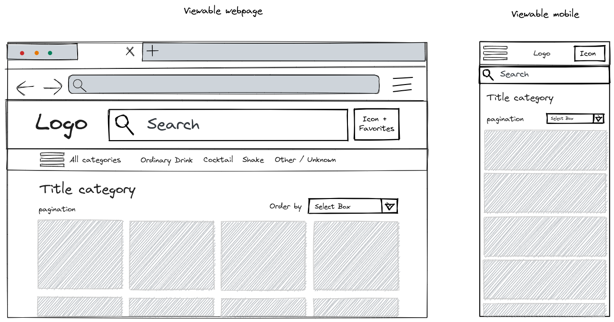

# Drink Faster

Project to be submitted for the position of Frontend developer at Faster. To test and evaluate my knowledge, I sought to develop and add the largest number of techniques and strategies within the proposed time.


### Obrigatórios
 - Criar documentação assertiva para a execução e apresentação do projeto no README; ✅
 - Utilizar typescript; ✅
 - Criar nome para aplicação; ✅
 - Tratamento básicos de erros da API; ✅
 - Fácil de buildar e executar a aplicação para testes ✅

### Opcionais
 - Tratamento para rotas que não existem; ✅
 - Escrever testes; ✅
 - Aplicação deve ser responsiva; ✅

### Diferenciais
 - Documentar decisões tomadas durante o desafio técnico. ✅
 - Paleta de cores única; ✅
 - UX agradável; ✅
 - Criar commits semânticos. ✅

## My challenge development

#### first I created a wireframe and survey of what needed to be done



#### Comments
 - I carried out the development based on the company's color palette to be better contextualized;
 - I would have liked to include the I18n for internationalization, but with the delivery time it was not possible;
  - Added Commitizen to help with commits;
  - Added a Github actions configuration to trigger tests on Pull requests

### Build Vercel
#### https://drink-faster.vercel.app/

### Videos showing some of the project
#### <a href="https://www.loom.com/share/1769b44e17a74b489675b4a006a0f92c?sid=f96a6b6f-5cd3-4741-9be6-aa9c9115dfdd" rel="stylesheet">Desktop</a>

#### <a href="https://www.loom.com/share/f5a8b6689f624138a4438c25298265e1?sid=124a3745-801c-4fdb-906f-dfc86216b48f">Mobile</a>


## API Reference - [Thecocktaildb](https://www.thecocktaildb.com/api.php)

#### List category

```http
  GET https://thecocktaildb.com/api/json/v1/1/list.php?c=list
```

#### Filter category

```http
  GET https://thecocktaildb.com/api/json/v1/1/filter.php?c=${category}
```

#### Filter no alcoholic

```http
  GET https://thecocktaildb.com/api/json/v1/1/filter.php?a=Non_Alcoholic
```

#### Get drink

```http
  GET https://thecocktaildb.com/api/json/v1/1/lookup.php?i=${id}
```

#### Search drink

```http
  GET https://thecocktaildb.com/api/json/v1/1/search.php?s=${search.value}
```

## Setup

Make sure to install the dependencies:

```bash
# yarn
yarn install
```

## Development Server

Start the development server on `http://localhost:3000`:

```bash
# yarn
yarn dev
```

## Production

Build the application for production:

```bash
# yarn
yarn build
```

Locally preview production build:

```bash
# yarn
yarn preview
```

Check the project repository on [Github](https://github.com/mathehm/drink-faster) for more information.
